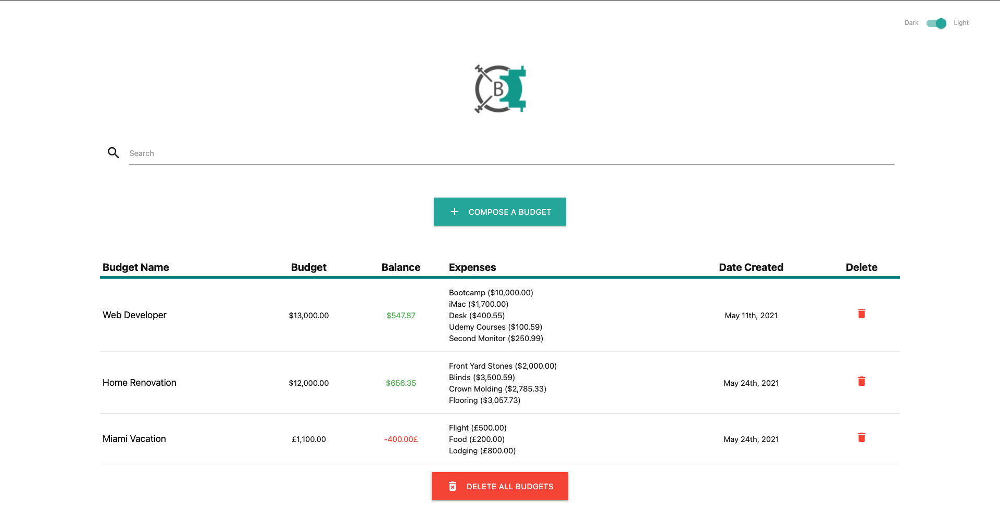
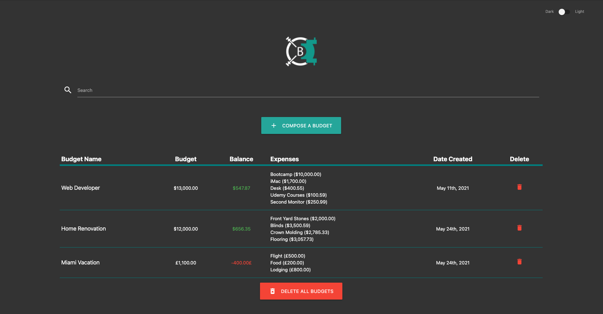
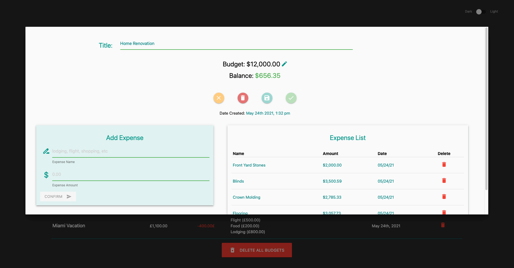

# Budget Vault

> A web app that allows the user to store a list of budgets.

### Table of Contents

- [Description](#description)
- [Installation](#installation)
- [Technologies](#technologies)
- [How To Use](#how-to-use)
- [Links](#links)
- [Author Info](#author-info)

---

## Description
Budget Vault is a Web App that allows you to set and save budgets.
Remodeling a home? Planning a trip?
Save your budget and expenses with Budget Vault.

---

## Installation
No requirements

---
[Back To The Top](#read-me-template)

## Technologies
Javascript, React, Redux, Node, Materialize, CSS, HTML5, IndexedDB

[Back To The Top](#read-me-template)

---

## How To Use
Visit https://budgetvaultapp.herokuapp.com/ to use the app. Click the 'Compose A Budget' button to create a budget. Enter your budget name, choose a currency, and enter an amount. Add an expense and it will subtract from your balance and display on the screen. Feel like your budget is getting a little low? You can modify your budget by clicking on the icon next to the budget amount. Once you've reached a good stopping point, click on the check icon to save and exit. You can edit or view your budget at anytime. Click on the corresponding table, or the view icon on mobile devices, to open the edit modal. Compose an other budget!
   
   [Back To The Top](#read-me-template)
   
---

## Links

Link to site:
https://budgetvaultapp.herokuapp.com/

Link to GitHub repository:
https://github.com/deleonfrancis/budget_vault

[Back To The Top](#read-me-template)

---

## Author Info

- E-mail: dxfrancis.coding@gmail.com

[Back To The Top](#read-me-template)

---

## License

MIT
Copyright (c) 2021 Deleon Francis

Permission is hereby granted, free of charge, to any person obtaining a copy
of this software and associated documentation files (the "Software"), to deal
in the Software without restriction, including without limitation the rights
to use, copy, modify, merge, publish, distribute, sublicense, and/or sell
copies of the Software, and to permit persons to whom the Software is
furnished to do so, subject to the following conditions:

The above copyright notice and this permission notice shall be included in all
copies or substantial portions of the Software.

THE SOFTWARE IS PROVIDED "AS IS", WITHOUT WARRANTY OF ANY KIND, EXPRESS OR
IMPLIED, INCLUDING BUT NOT LIMITED TO THE WARRANTIES OF MERCHANTABILITY,
FITNESS FOR A PARTICULAR PURPOSE AND NONINFRINGEMENT. IN NO EVENT SHALL THE
AUTHORS OR COPYRIGHT HOLDERS BE LIABLE FOR ANY CLAIM, DAMAGES OR OTHER
LIABILITY, WHETHER IN AN ACTION OF CONTRACT, TORT OR OTHERWISE, ARISING FROM,
OUT OF OR IN CONNECTION WITH THE SOFTWARE OR THE USE OR OTHER DEALINGS IN THE
SOFTWARE.
